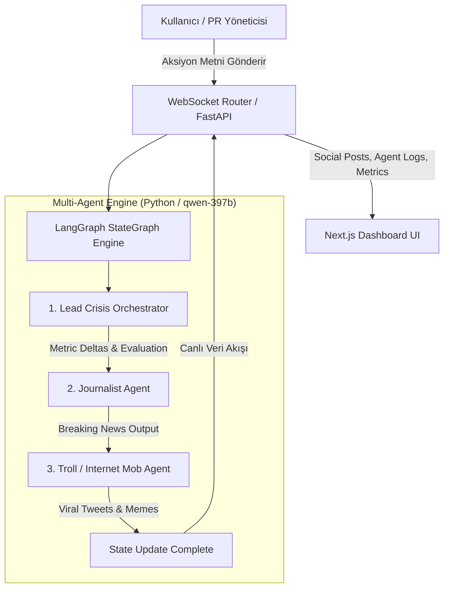

# Project Dont Panic — AI-Tabanlı Kurumsal Kriz Yönetimi & PR Simülatörü

Project Dont Panic, yüksek riskli kurumsal kriz anlarında (veri sızıntısı, yapay zeka hataları, CEO deepfake skandalları vb.) yöneticilerin ve PR ekiplerinin kriz iletişimi stratejilerini gerçek zamanlı simüle eden Multi-Agent (Çoklu Yapay Zeka Ajanı) destekli bir simülasyon platformudur.

---

## Proje Özeti ve Çalışma Mantığı

Kullanıcı, simülasyon terminalinden kriz anına yönelik bir basın açıklaması veya stratejik hamle girer. Arka planda LangGraph mimarisiyle çalışan yapay zeka ajanları bu açıklamayı anında değerlendirir:

1. **Strateji Ajanı (Orchestrator):** Kriz Şiddet Seviyesi, Marka İtibar Endeksi ve Borsa Hisse Etkisi metriklerindeki anlık değişimi hesaplar.
2. **Gazeteci Ajanı (Journalist):** Bloomberg veya TechChronicle tarzı medya organlarının son dakika haber başlıklarını üretir.
3. **Sosyal Medya Ajanı (Troll):** İnternet halkının, sosyal medyanın (Twitter/X vb.) vereceği viralleşen tepkileri ve linç dalgalarını simüle eder.

Tüm sonuçlar WebSockets protokolü ile gecikmesiz olarak ön yüzdeki canlı kontrol paneline akar.

---

## Öne Çıkan Özellikler

- **Çoklu Ajan Mimarisi:** LangGraph ve qwen-397b büyük dil modeli ile birbiriyle uyumlu çalışan 3 farklı uzmanlaşmış ajan (Orchestrator, Journalist, Troll).
- **Canlı Telemetri & Analitik:** Recharts kütüphanesi ile Kriz Şiddet Seviyesi, Marka İtibarı ve Borsa Değişiminin tur bazlı grafiksel takibi.
- **Gerçek Zamanlı Canlı Akış (WebSockets):** Ajanların akıl yürütme adımlarının ve ürettikleri sosyal medya içeriklerinin anlık ekrana düşmesi.
- **Şeffaf Ajan Akıl Yürütme Konsolu:** Yapay zekanın kararları alırken izlediği mantık adımlarının (Chain-of-Thought) kullanıcıya şeffaf gösterimi.
- **Hazır Kriz Senaryoları:**
  - **Data Breach 2026:** Biyometrik veri sızıntısı skandalı.
  - **AI Hallucination Scandal:** Tıbbi yapay zeka hatalı teşhis vakası.
  - **CEO Deepfake Leak:** CEO adına üretilen şantaj içerikli sahte ses/video sızıntısı.

---

## Sistem Mimarisi & Akış Diyagramı



---

## Teknoloji Yığını

### Arka Yüz (Backend)
- **Dil / Runtime:** Python 3.10+
- **API Framework:** FastAPI, Uvicorn
- **Yapay Zeka Mimarisi:** LangGraph, LangChain, Pydantic
- **İletişim Protokolü:** Real-Time WebSockets
- **LLM Motoru:** Custom Qwen Provider (qwen-397b)

### Ön Yüz (Frontend)
- **Framework:** Next.js 15 (App Router), React 19, TypeScript
- **Stil & Tasarım:** Tailwind CSS, Lucide Icons
- **Grafik & Veri Görselleştirme:** Recharts
- **State Yönetimi:** Zustand

---

## Kurulum ve Çalıştırma

### Ön Gereksinimler
- Python 3.10 veya üzeri
- Node.js 18.0 veya üzeri

---

### 1. Arka Yüz (Backend) Kurulumu

```bash
cd backend
python3 -m venv venv
source venv/bin/activate
pip install -r requirements.txt
cp .env.example .env
uvicorn app.main:app --reload --port 8000
```
Backend http://localhost:8000 üzerinde çalışacaktır.

---

### 2. Ön Yüz (Frontend) Kurulumu

```bash
cd frontend
npm install
npm run dev
```
Frontend http://localhost:3000 üzerinde açılacaktır.

---

## Güvenlik ve Konfigürasyon

Projedeki hassas veriler (LLM_API_KEY vb.) root dizinindeki `.gitignore` kuralları ile koruma altındadır. 

Projeyi klonlayan kullanıcılar `backend/.env.example` dosyasını referans alarak kendi `backend/.env` dosyalarını oluşturmalıdır:

```env
PORT=8000
HOST=0.0.0.0
ENV=development

LLM_API_KEY=your_actual_api_key_here
LLM_BASE_URL=https://api.your-llm-provider.com/v1
LLM_MODEL=qwen-397b
```

---

## Lisans

Bu proje MIT Lisansı altında lisanslanmıştır.
