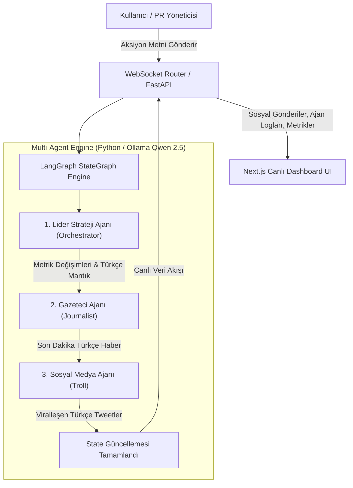

#  Project Dont Panic — AI-Tabanlı Kurumsal Kriz Yönetimi & PR Simülatörü

**Project Dont Panic**, yüksek riskli kurumsal kriz anlarında (veri sızıntıları, yapay zeka hataları, CEO deepfake skandalları vb.) üst düzey yöneticilerin ve PR ekiplerinin kriz iletişimi stratejilerini gerçek zamanlı simüle eden **Multi-Agent (Çoklu Yapay Zeka Ajanı)** destekli bir simülasyon ve eğitim platformudur.


---

## 📌 Proje Özeti ve Çalışma Mantığı

Kullanıcı (PR Yöneticisi), kriz müdahale terminalinden şirketin resmi basın açıklamasını veya taktik kriz hamlesini girer. Arka planda **LangGraph** mimarisi ve **Qwen 2.5 / LLM** motoruyla çalışan 3 farklı uzmanlaşmış yapay zeka ajanı hamleyi anında değerlendirir:

1.  **Lider Strateji Ajanı (Orchestrator):** Kullanıcının hamlesini analiz eder; Kriz Şiddet Seviyesi (0-100), Marka İtibar Puanı (0-100) ve Borsa Hisse Etkisi (%) metriklerindeki anlık değişimi hesaplar ve Türkçe mantık zinciri (Chain-of-Thought) oluşturur.
2. **Gazeteci Ajanı (Journalist):** Bloomberg, TeknoKriz Haber veya HürMedya gibi ana akım medya organlarının gözünden Türkçe son dakika kriz haber başlıkları üretir.
3. **Sosyal Medya Ajanı (Troll):** İnternet halkının ve sosyal medyanın (Twitter/X vb.) vereceği viralleşen mizahi tepkileri, linç dalgalarını veya destek tweetlerini simüle eder.

Tüm metrikler ve ajan mantık logları **WebSockets** protokolü ile gecikmesiz (real-time) olarak kullanıcı arayüzüne akar.

---

## ✨ Öne Çıkan Özellikler

-  **Çoklu Ajan (Multi-Agent) Mimarisi:** LangGraph StateGraph motoru ile birbirini takip eden 3 uzman ajan (Orchestrator ➔ Journalist ➔ Troll).
-  **%100 Ücretsiz Yerel LLM Desteği (Ollama):** Gizlilik odaklı, kotasız ve ücretsiz yerel çalıştırma için **Ollama (Qwen 2.5)** entegrasyonu.
-  **Canlı Akış & WebSockets:** Ajanların düşünme adımları ve sosyal medya akışı anlık olarak ekrana düşer.
-  **Türkçe Akıl Yürütme Konsolu (Chain-of-Thought):** Yapay zekanın kararları alırken izlediği stratejik mantığın Türkçe şeffaf gösterimi.
-  **Canlı Telemetri & Analitik:** Recharts kütüphanesi ile tur bazlı Kriz Şiddeti, Marka İtibarı ve Borsa Grafik takibi.
-  **Hazır Kriz Senaryoları:**
  - **Data Breach 2026:** Biyometrik veri sızıntısı skandalı.
  - **AI Hallucination Scandal:** Tıbbi yapay zeka hatalı teşhis vakası.
  - **CEO Deepfake Leak:** Şantaj içerikli sahte CEO video sızıntısı.

---

##  Sistem Mimarisi



---

##  Teknoloji Yığını

### Arka Yüz (Backend)
- **Dil & Runtime:** Python 3.10+
- **API Framework:** FastAPI, Uvicorn
- **Yapay Zeka Mimarisi:** LangGraph, LangChain, Pydantic
- **İletişim Protokolü:** Real-Time WebSockets
- **LLM Sağlayıcısı:** Ollama (Qwen 2.5) / Custom OpenAI-Compatible Provider

### Ön Yüz (Frontend)
- **Framework:** Next.js 16 (App Router), React 19, TypeScript
- **Stil & Tasarım:** Tailwind CSS, Lucide Icons
- **Grafik & Veri Görselleştirme:** Recharts
- **State Yönetimi:** Zustand

---

## 🚀 Kurulum ve Çalıştırma

### Ön Gereksinimler
- **Python 3.10+**
- **Node.js 18+**
- **Ollama** (Ücretsiz yerel LLM çalıştırmak için)

---

### 1. Yerel Ollama Kurulumu (Ücretsiz LLM)

```bash
# macOS üzerinde Ollama kurulumu (Homebrew ile)
brew install ollama
brew services start ollama

# Türkçe performansı yüksek Qwen 2.5 modelini indirin
ollama pull qwen2.5:1.5b
```

---

### 2. Arka Yüz (Backend) Kurulumu

```bash
cd backend

# Sanal ortam oluşturma ve aktifleştirme
python3 -m venv venv
source venv/bin/activate

# Bağımlılıkları yükleme
pip install -r requirements.txt

# Çevre değişkenlerini ayarlama
cp .env.example .env

# Backend sunucusunu başlatma
uvicorn app.main:app --reload --port 8000
```
> Backend API: `http://localhost:8000`

---

### 3. Ön Yüz (Frontend) Kurulumu

```bash
cd frontend

# Bağımlılıkları yükleme
npm install

# Geliştirici sunucusunu başlatma
npm run dev
```
> Ön Yüz Dashboard: `http://localhost:3000`

---

## ⚙️ Yapılandırma (`backend/.env`)

Yerel Ollama kullanımı için `backend/.env` dosyası aşağıdaki şekilde yapılandırılmalıdır:

```env
PORT=8000
HOST=0.0.0.0
ENV=development

# Yerel Ollama Yapılandırması (Ücretsiz & Yerel)
LLM_API_KEY="ollama"
LLM_BASE_URL="http://127.0.0.1:11434/v1"
LLM_MODEL="qwen2.5:1.5b"
```

*(Bulut tabanlı bir LLM API kullanmak isterseniz `LLM_BASE_URL`, `LLM_API_KEY` ve `LLM_MODEL` alanlarını ilgili sağlayıcınıza göre güncelleyebilirsiniz).*

---

##  Güvenlik

Hassas API anahtarları ve ortama özel yapılandırmalar KESİNLİKLE `.gitignore` kuralları ile koruma altındadır ve GitHub repolara yüklenmez. 

