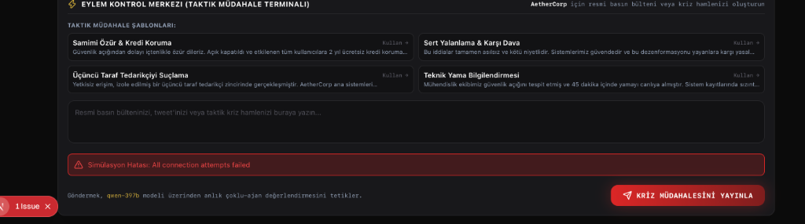
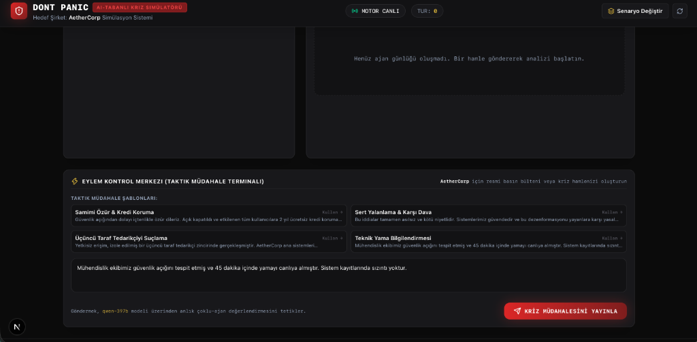
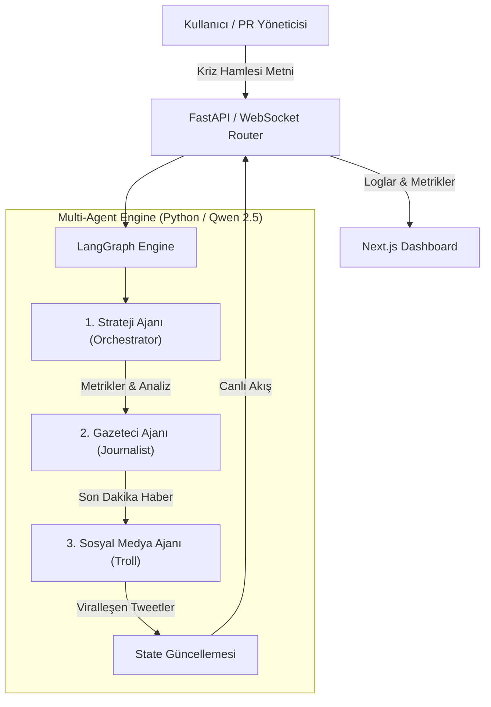

# Project Dont Panic — AI-Tabanlı Kriz Yönetimi & PR Simülatörü

**Project Dont Panic**, kurumsal kriz anlarında (veri sızıntıları, sistem kesintileri, CEO açıklamaları vb.) PR ekiplerinin ve yöneticilerin kriz iletişimi stratejilerini gerçek zamanlı simüle eden çoklu ajan (Multi-Agent) tabanlı bir eğitim ve analiz platformudur.





---

## Proje Özeti ve Çalışma Mantığı

Kullanıcı kriz müdahale terminalinden şirketin resmi basın açıklamasını veya taktik hamlesini girer. Arka planda **LangGraph** mimarisiyle çalışan 3 farklı uzmanlaşmış ajan hamleyi anında değerlendirir:

1. **Lider Strateji Ajanı (Orchestrator):** Kullanıcının hamlesini analiz ederek Kriz Şiddeti (0-100), Marka İtibarı (0-100) ve Borsa Hisse Etkisi (%) değerlerindeki değişimi hesaplar ve mantıksal gerekçesini sunar.
2. **Gazeteci Ajanı (Journalist):** Basın ve medya organlarının gözünden son dakika kriz haber başlıkları üretir.
3. **Sosyal Medya Ajanı (Troll):** Sosyal medyanın (Twitter/X vb.) vereceği viralleşen tepkileri, mizahi yorumları ve linç dalgalarını simüle eder.

Tüm metrikler ve ajan analiz günlükleri **WebSockets** protokolü üzerinden canlı olarak arayüze aktarılır.

---

## Öne Çıkan Özellikler

- **Çoklu Ajan Mimarisi:** LangGraph StateGraph yapısı ile sıralı çalışan 3 uzman ajan (Orchestrator ➔ Journalist ➔ Troll).
- **Yerel LLM Desteği (Ollama):** Kotasız ve gizlilik odaklı yerel çalıştırma için Ollama (Qwen 2.5) entegrasyonu.
- **Gerçek Zamanlı Akış:** WebSockets ile ajan düşünme adımlarının ve sosyal medya akışının anlık takibi.
- **Telemetri & Analitik:** Recharts ile tur bazlı kriz şiddeti, itibar puanı ve borsa değişimi grafikleri.
- **Hazır Senaryolar:**
  - **Data Breach 2026:** Biyometrik veri sızıntısı skandalı.
  - **AI Hallucination Scandal:** Tıbbi yapay zeka hatalı teşhis vakası.
  - **CEO Deepfake Leak:** Sahte CEO video sızıntısı.

---

## Sistem Mimarisi



---

## Teknoloji Yığını

### Backend
- **Dil & Runtime:** Python 3.10+
- **Framework:** FastAPI, Uvicorn
- **Yapay Zeka Mimarisi:** LangGraph, LangChain, Pydantic
- **İletişim:** WebSockets
- **LLM:** Ollama (Qwen 2.5) / OpenAI Uyumlu API

### Frontend
- **Framework:** Next.js 16 (App Router), React 19, TypeScript
- **Stil:** Tailwind CSS, Lucide Icons
- **Grafik:** Recharts
- **State:** Zustand

---

## Kurulum ve Çalıştırma

### Ön Gereksinimler
- Python 3.10+
- Node.js 18+
- Ollama

---

### 1. Yerel Ollama Kurulumu

```bash
# Ollama kurulumu (macOS)
brew install ollama
brew services start ollama

# Qwen 2.5 modelini indirin
ollama pull qwen2.5:7b
```

---

### 2. Backend Kurulumu

```bash
cd backend
python3 -m venv venv
source venv/bin/activate

pip install -r requirements.txt
cp .env.example .env

uvicorn app.main:app --reload --port 8000
```
> Backend: `http://localhost:8000`

---

### 3. Frontend Kurulumu

```bash
cd frontend
npm install
npm run dev
```
> Frontend: `http://localhost:3000`

---

## Yapılandırma (`backend/.env`)

```env
PORT=8000
HOST=0.0.0.0
ENV=development

# Ollama Yapılandırması
LLM_API_KEY="ollama"
LLM_BASE_URL="http://127.0.0.1:11434/v1"
LLM_MODEL="qwen2.5:7b"
```

---

## Güvenlik

Hassas API anahtarları ve ortama özel yapılandırmalar `.gitignore` ile koruma altındadır.
